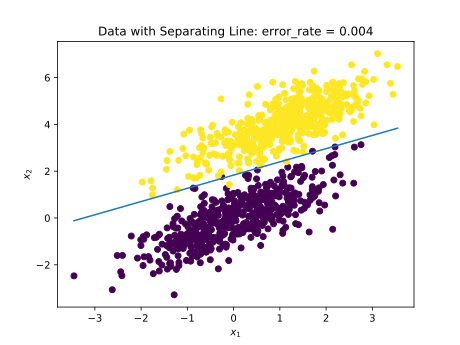
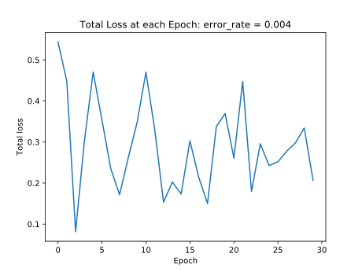
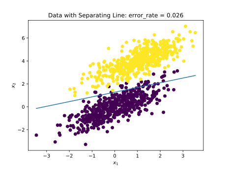
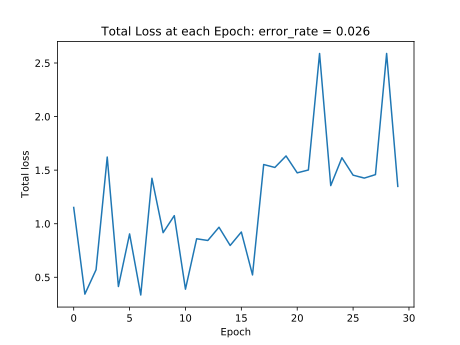

# 感知机

## 方法原理

1. 感知机模型
\\[
f(x)=\begin{cases}
1 &\text{if } w^\top x > 0 \\
0 &\text{otherwise} 
\end{cases}
\\]
	其中 $x$ 是输入特征。

2. 感知机学习算法，对于第 $j$ 个样本，第 $t$ 次迭代
	\\[
	w(t+1)=w(t)+r\cdot(y_j-f_j(t))\cdot x_j
	\\] 
	其中
	$f_j(t)=\begin{cases}
   1 &\text{if } w(t)^\top x_j > 0 \\
   0 &\text{otherwise} 
   \end{cases}$
， $w(t)$ 为第 $t$ 次迭代的权重向量

## 实验步骤

1. 数据生成：使用`numpy`的生成两类二维数据，分别服从两个二维高斯分布

	```Python
	import numpy as np
	from matplotlib import pyplot as plt

	def data_generation(num_observations=500, seed=12):
		np.random.seed(seed)
		x1 = np.random.multivariate_normal([0, 0], [[1, .75], [.75, 1]], num_observations)
		x2 = np.random.multivariate_normal([1, 4], [[1, .75], [.75, 1]], num_observations)
		X = np.vstack((x1, x2)).astype(np.float32)
		Y = np.hstack((-np.ones(num_observations), np.ones(num_observations)))
		return X, Y
	```

2. 定义类`Perceptron`，有如下methods
	- `__init__(self, max_iterations, learning_rate, shuffle=True)` 实例化分类器，并给出参数，如是否shuffle数据 
	- `‌fit(self, x, y)` 执行感知机算法并记录每个epoch的loss，并在执行结束后计算错误率
	- `plot(self, save_file=False)` 画出数据点和分割线
	- `plot_losses(self, save_file=False)` 画出每个epoch的loss

3. 执行算法

## 参数讨论

本实现涉及三个参数

- `max_iterations` 最大完整迭代次数
- `learning_rate` 学习率
- `shuffle` 是否shuffle数据

## 实验结果

1. `Perceptron(max_iterations=30, learning_rate=.1, shuffle=True)`



	
2. `Perceptron(max_iterations=30, learning_rate=.1, shuffle=False)`



	
## 结论

1. `shuffle`数据后分类错误率更低，算法也更稳定
2. 若用`0`向量初始化`w`，则学习率不会影响分类结果
	\\[
	\begin{aligned}
	w(1) &= w(0)+r\cdot(y_j-f_j(0))\cdot x_j \\
		   &= r\cdot(y_j-f_j(0))\cdot x_j \\
		   &= r\cdot y_j\cdot x_j \\
	w(2) &= w(1)+r\cdot(y_{j+1}-f_{j+1}(1))\cdot x_{j+1} \\
			 &= r\cdot [y_{j}\cdot x_{j} + (y_{j+1}-f_{j+1}(1))\cdot x_{j+1}] \\
			 &= r\cdot \textit{与r无关} \\
			 &\vdots
	\end{aligned}
	\\] 
	同理 $w(t)$ ， $r$ 不影响 $w$ 的方向
3. `0`向量初始时，减小学习率及适当增加迭代次数有助于降低错误率
4. `max_iterations`足够大时，继续增大不影响错误率

## GitHub

[https://github.com/JyChang012/ComputerVisionCourseworks/blob/master/1%20Perceptron/main.py](https://github.com/JyChang012/ComputerVisionCourseworks/blob/master/1%20Perceptron/main.py)
