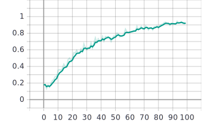

# Spatial Localization and Detection

## Network Structure

###  Bounding Box Regression network

## Results

### Regression head

### Classification head

### Demo

## Github

[https://github.com/JyChang012/ComputerVisionCourseworks](https://github.com/JyChang012/ComputerVisionCourseworks)